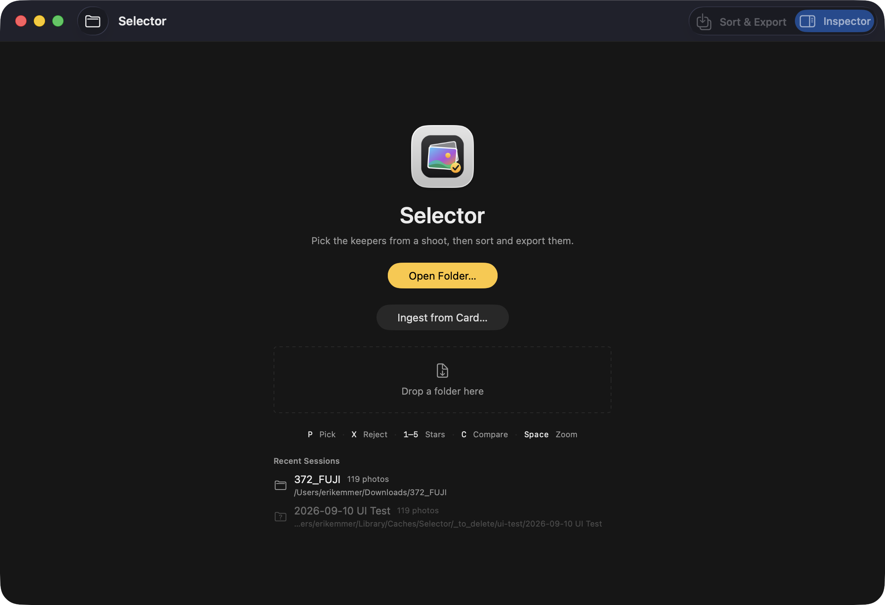
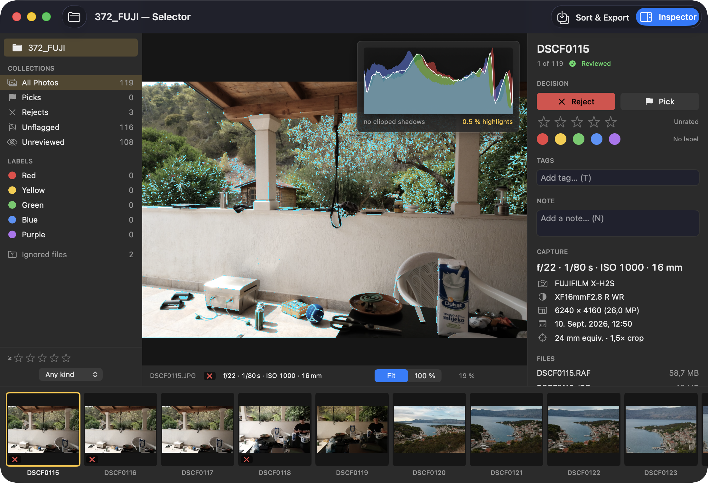
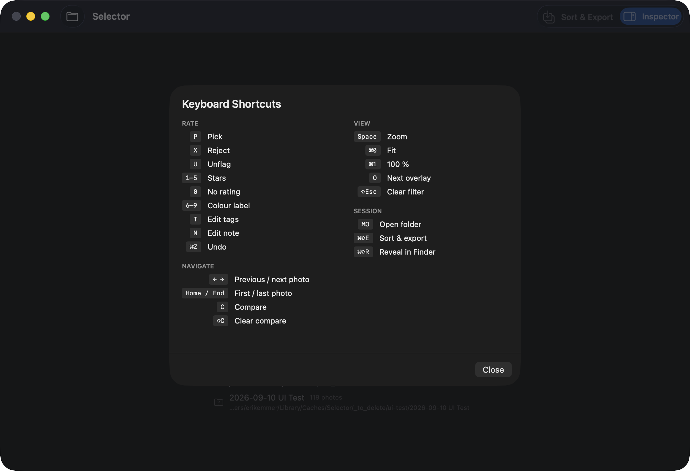

# SlateKit

The look of a slate-grey, Final-Cut-shaped desktop app, as reusable SwiftUI
parts. Shared by **Selector** (photo culling) and **Shelf** (eBook manager), so
the two are siblings rather than two apps that happen to be dark.

macOS 14+, Swift 6 with strict concurrency, no dependencies.

## The line this package draws

Everything in here is about **appearance and layout**. Nothing in it knows about
photos, books, or any other subject matter. A flag, a filmstrip, a histogram
curve, an ISBN — those stay in the app. A sidebar row that shows a name and a
count does not care what it is counting, so it lives here.

That is the whole test: *could the other app use this unchanged?*

## Components

| | |
|---|---|
| `Slate` | The palette and the metrics: window / panel / content greys, separator, primary and secondary text, the Final Cut accent, affirm and deny, two corner radii. |
| `SlateSwatch` | The five label colours (red…purple), close enough to Lightroom's that a picture keeps its meaning between tools. |
| `SlateSidebarSection` | The small capitalised heading above a group of sidebar rows. |
| `SlateSidebarRow` | Icon, name, count on the right, accent wash while active. No width of its own — the column decides. Reports whether ⌘ was held, so a list can offer "narrow down" as well as "show". |
| `SlateSidebarHeaderRow` | The row at the top naming what is open. |
| `SlateInspectorSection` | One block of an inspector: quiet heading, content under it. |
| `SlateFactRow` | Symbol and value, for a `Grid` of facts that line up. |
| `SlateValueRow` | Name left, value right, filling the width. |
| `SlateStarRating` | Five clickable stars and the value in words. Knows nothing but an `Int`. |
| `SlateChip` / `SlateSuggestionChip` | A keyword that is part of the record, and one that is merely offered. |
| `SlateWrappingChips` / `SlateFlowLayout` | Chips that wrap like text. |
| `SlateGridCell` | A square tile with a caption: content background, three badge corners, the selection frame drawn over everything. |
| `SlateBadgePlate` | The dark plate that keeps a badge readable over any picture. |
| `SlateStatusBar` | The quiet line at the foot of a panel saying what the machine is busy with. It never says "done". |
| `SlateBanner` | A one-line banner over the content for something that went wrong. |
| `SlateOverlayPanel` | A floating plate over the content — a measurement, a readout. Opaque enough to read over anything, and it never takes clicks. |
| `SlateGraphWell` | The dark well a graph is drawn into, inside an overlay panel. |
| `SlateShortcut` | One shortcut as the user reads it. The app owns the table. |
| `SlateKeyBadge` | The key itself, monospaced so ⌘⇧E and 1–5 line up. |
| `SlateShortcutLine` | The handful worth knowing, on one line, for a welcome screen. |
| `SlateShortcutSheet` | All of them at once, grouped, split into two columns by line count so neither side is a wall. |
| `SlateWelcomeLayout` | The centred column a window shows before anything is open, capped at 420 pt. |
| `SlateWelcomeHeader` | App icon, name, one line saying what the app is for. |
| `SlatePrimaryButton` / `SlateSecondaryButton` | The way in most days start with, and the other one. |
| `SlateDropZone` | A dashed rectangle that lights up when something is held over it. |
| `SlateRecentList` / `SlateRecentRow` | "Recent", and one entry in it. An entry whose folder is not there right now is dimmed, never hidden. |

## How it looks







All three are Selector, built against this package.

Moving those components out of the app changed **not one pixel**: the same four
screens, photographed before and after with the same script, differ in zero of
3.3 million pixels. Two things had to be held still for that to be true — the
window has to be key (a prominent button is only yellow while it is), and it
has to sit at the same position on screen, because the title bar and the
rounded text fields are translucent and blur the desktop behind them.

Two more screens the first pass did not cover — Compare (two images side by
side) and the Sort & Export sheet — were checked the same way, against
Selector `cb29de7` (the last commit before this package existed): **0 of
4 786 176 pixels differ**, for both. One extra thing had to be held still here
that the first four screens never touched: real photo thumbnails in the
filmstrip load progressively, so the very first attempt (before either build's
thumbnails had settled) flagged 94 441 pixels in exactly that strip and
nowhere else; a few seconds' wait before the screenshot made the difference
vanish. The window-position/key-window fix still came from a low-level
activation step this round used that the original four-screen pass didn't
need: launching two instances of the *same* bundle identifier (the running
Xcode debug build and a fresh test instance) confused `System Events`' name-
based process targeting badly enough that keystrokes went to the wrong
window once. `NSRunningApplication(processIdentifier:).activate(...)`,
verified against `NSWorkspace.frontmostApplication` before every keystroke,
fixed it for good.

## Working on it

```bash
make test      # unit tests
make lint      # swift-format, strict
make format    # reformat in place
make contrast  # every text/background pair against WCAG AA
```

`make contrast` reads the palette straight out of `SlateTheme.swift` — it
cannot go stale the way a hand-copied table would — and checks every pair
either app actually draws: text on each panel background, the primary
button's black-on-accent fill, the banner's fill, the active sidebar row's
tint, and the five label swatches as non-text graphical dots (WCAG 1.4.11,
3:1, not the 4.5:1 text needs). It found three real failures at `0.1.0` —
`deny` at 4.0:1 on `panelBackground`, the banner's white text as low as
1.9:1 on `accent`, and the active sidebar row's count text at 3.2:1 — fixed
in `0.1.1`.

Only the arithmetic is unit-tested — chip wrapping and the shortcut sheet's
column split. The rest is declarative SwiftUI, which a unit test cannot judge;
the apps that use it compare screenshots before and after instead.

## Releasing a change

Apps depend on a **tag**, never on a path. After a change here:

1. `make test && make lint`
2. commit, then `git tag 0.2.0 && git push origin main --tags`
3. in the app, raise the version in `Package.swift` / `project.yml` and rebuild.

That way an app is never quietly changed by an edit in this repo.
